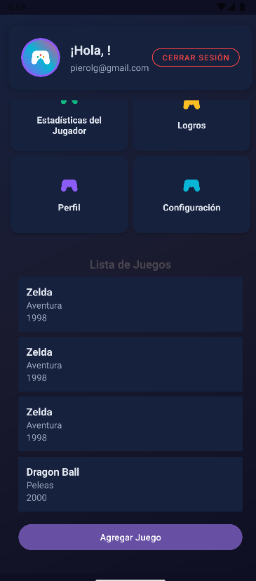
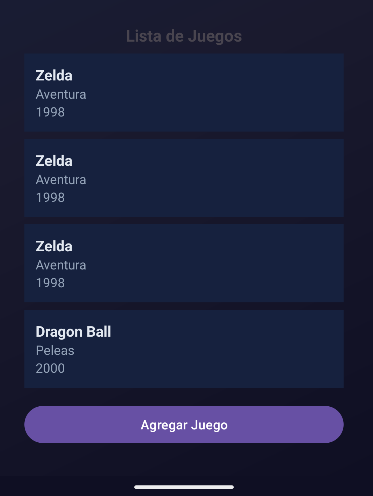
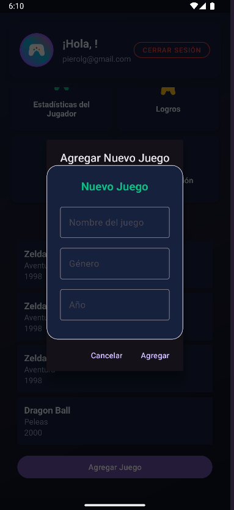
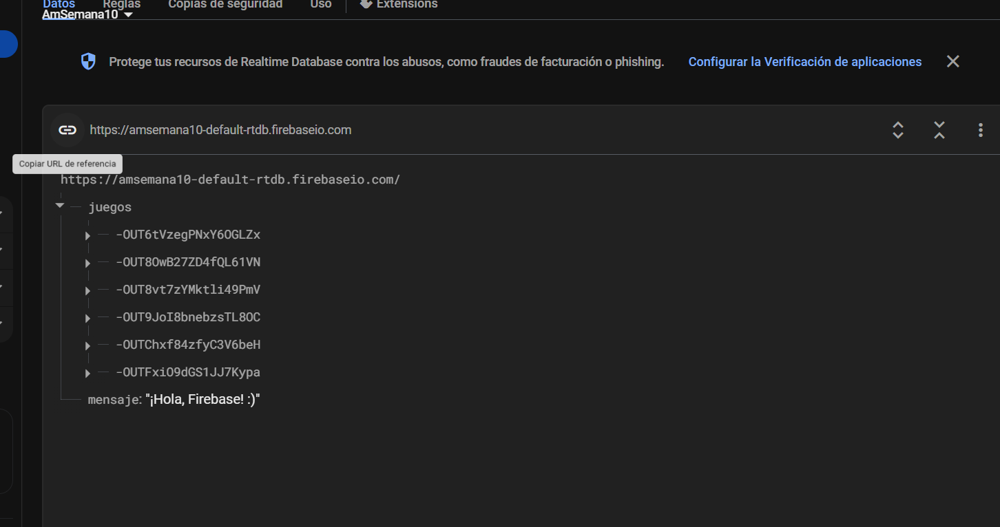

# SEMANA 8  
# ALUMNO: LIZA GUERRERO PIERO ALEXANDRO  
# CÓDIGO: 0202114037  

# App Zone – CRUD con Firebase

**App Zone** es una aplicación móvil Android creada como proyecto académico para el curso **Aplicaciones Móviles** (Ingeniería de Sistemas).  
El objetivo es practicar la integración de **Firebase Realtime Database** en Android Studio, implementando un CRUD completo y aplicando Material Design 3 con una interfaz tipo “gaming”.

---

## 🚩 ¿QUÉ HACE LA APLICACIÓN?

La app **App Zone** permite:
- Autenticarse con correo/contraseña usando Firebase Auth.
- Visualizar y gestionar (crear, leer, actualizar, eliminar) una **lista de videojuegos** conectada en tiempo real a Firebase.
- Añadir nuevos juegos a la base de datos, editar o eliminar los existentes desde la interfaz.
- Disfrutar de una **interfaz gamer moderna** y responsiva, adaptada a Material Design 3.

---

## 🎮 FUNCIONALIDADES Y COMPONENTES IMPLEMENTADOS

- **Material Design 3:**  
  Toda la app está adaptada a colores y componentes modernos, con fondo oscuro y detalles neón.
- **Firebase Realtime Database:**  
  Integración completa para operaciones CRUD en tiempo real.
- **Firebase Authentication:**  
  Registro e inicio de sesión de usuarios.
- **RecyclerView + MaterialCardView:**  
  Lista de juegos mostrada en tarjetas elegantes.
- **Diálogo personalizado:**  
  Para agregar o editar juegos, con campos validados.
- **Compatibilidad:**  
  Funciona desde Android 7.1 (API 25) en adelante.

---

## 🗂️ SECCIONES DE LA APP

- **Login / Registro:**  
  Autenticación básica con Firebase.
- **Pantalla Principal:**  
  Bienvenida al usuario y navegación por secciones (estadísticas, logros, perfil, configuración).
- **Lista de Juegos:**  
  CRUD visual con diseño atractivo.
- **Agregar/Editar Juego:**  
  Diálogo con campos personalizables y validación de datos.

---

## 🖼️ CAPTURAS DE PANTALLA

<!-- Guarda tus imágenes en /images y enlázalas así: -->

<p align="center">
  
  
  
  
</p>

---

## 🔨 CÓMO SE HIZO

1. **Proyecto creado en Android Studio con Kotlin y Material 3.**
2. **Integración con Firebase:**  
   - Se añadió el archivo `google-services.json` (no incluido en el repo por seguridad, cada usuario debe usar el suyo).
   - Se configuró Realtime Database y Authentication.
3. **CRUD implementado:**  
   - Modelos y adaptadores personalizados (`Game`, `GameAdapter`).
   - Operaciones de crear, leer, actualizar y eliminar juegos.
4. **UI moderna y temática gaming:**  
   - CardViews, diálogos custom, y botones adaptados a la estética de la app.
5. **Buenas prácticas:**  
   - Código limpio y modular, separación de lógica y vista.

---

## 💻 INSTALACIÓN Y USO

1. Clona el repositorio:

   ```bash
   git clone https://github.com/PieroL1/app_zone_app.git
